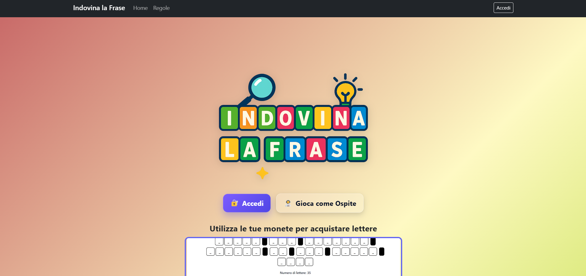
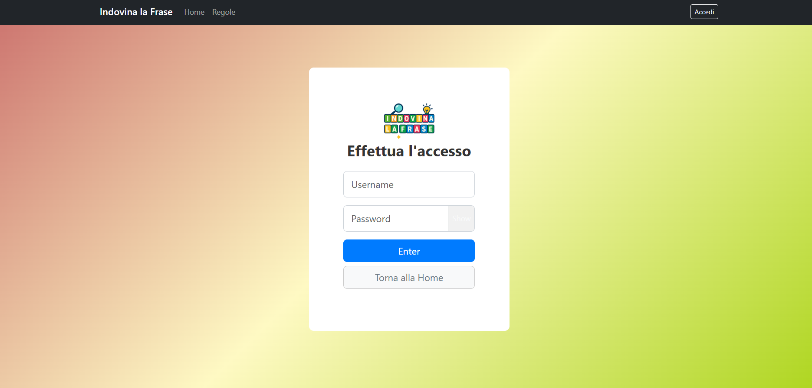
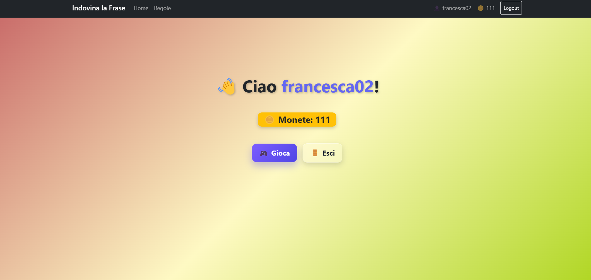
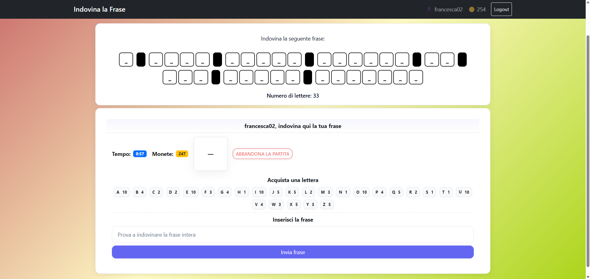
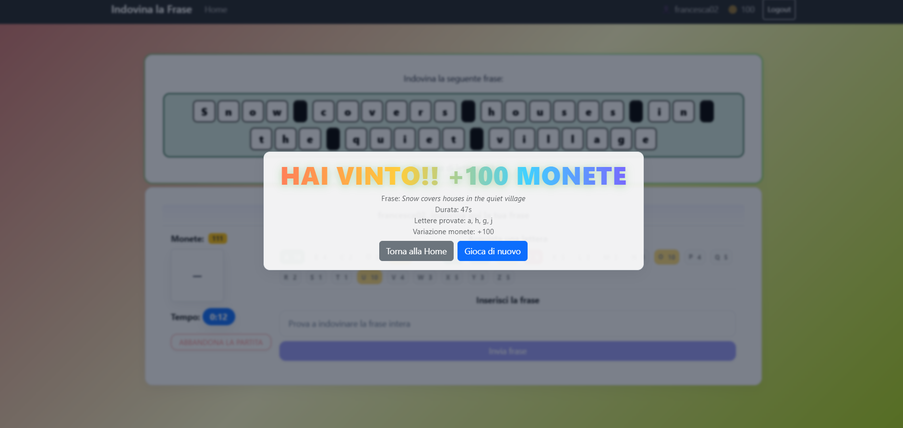

# Exam #N3: "Indovina la frase"
## Student: s348916 TORNESELLO GIANLUCA 

## React Client Application Routes

- Route `/game`: pagina della partita: mostra la griglia, timer/controlli e usa le API di gioco (POST /api/game) per avviare/aggiornare la sessione.
- Route `/regole`: modulo di autenticazione; al successo reindirizza alla pagina di gioco.
- Route `/login`: page content and purpose, param specification
- Route `/home`: page content and purpose, param specification

## API Server

- POST `/api/game/init`
  - request nessun body.
  - response:
    - (ok): { success: true, phrase: { id }, masked: string, numLetters: number, letterList: string[], monete: number, serverNow: number, expiresAt: number }
    - (errore logico): HTTP 400 { success: false, error: "Monete insufficienti per avviare una partita" | "No active game in session" }.
    - (errore server/DB): HTTP 500 { success: false, error: "Internal server error" }.

- POST `/api/game/letter`
  - request body JSON { letter: string }.
  - response:
    - (ok): { success: true, letter: string, letterList: string[], masked: string, numLetters: number, monete: number, serverNow: number, expiresAt: number }
    - (game over): { success: true, gameOver: true, summary: { reason: "win"|"lose", phrase: string, lettersTried: string[], durationSec: number, coinsDelta?: number }, monete: number, canPlayAgain: boolean }
    - (errore validazione): HTTP 400 { success: false, error: "You must provide a single letter (A-Z)" }.
    - (errore logico): HTTP 400 { success: false, error: "No active game/phrase in session" }.
    - (errore server/DB): HTTP 500 { success: false, error: "Internal server error" }.

- POST `/api/game/phrase`
  - request body JSON { text: string }.
  - response:
    - (ok, frase indovinata): { success: true, correct: true, masked: string, monete: number, summary: { reason: "win", phrase: string, lettersTried: string[], durationSec: number, coinsDelta?: number }, gameOver: true, canPlayAgain: boolean }
    - (ok, frase errata ma partita continua): { success: true, correct: false, masked: string, serverNow: number, expiresAt: number }
    - (ok, frase errata con sconfitta): { success: true, correct: false, gameOver: true, summary: { reason: "lose", phrase: string, lettersTried: string[], durationSec: number, coinsDelta?: number }, monete: number }
    - (errore validazione): HTTP 400 { success: false, error: "You must provide a phrase" }.
    - (errore logico): HTTP 400 { success: false, error: "No active game/phrase in session" }.
    - (errore server/DB): HTTP 500 { success: false, error: "Internal server error" }.

- POST `/api/game/abandon`
  - request nessun body.
  - response:
    - (ok): { success: true, gameOver: true, summary: { reason: "abandon", phrase: string, lettersTried: string[], durationSec: number, coinsDelta?: number }, monete: number, canPlayAgain: boolean }
    - (errore logico): HTTP 400 { success: false, error: "No active game in session" }.
    - (errore server/DB): HTTP 500 { success: false, error: "Internal server error" }.

- POST `/api/game/timeout`
  - request nessun body.
  - response:
    - (ok): { success: true, gameOver: true, summary: { reason: "timeout", phrase: string, lettersTried: string[], durationSec: number, coinsDelta?: number }, monete: number, canPlayAgain: boolean }
    - (errore logico): HTTP 400 { success: false, error: "No active game in session" }.
    - (errore server/DB): HTTP 500 { success: false, error: "Internal server error" }.

- GET `/api/me`
  - request nessun body.
  - response:
    - (utente loggato): { success: true, isLogged: true, user: { username: string, monete: number, gamesPlayed: number } }.
    - (ospite/non loggato): { success: true, isLogged: false, user: null }.
    - (errore server): HTTP 500 { success: false, error: "Internal server error" }.

- POST `/api/login`
  - request body JSON { username: string, password: string, rememberMe: boolean }.
  - response:
    - (ok): { success: true, user: { username: string, monete: number } }.
    - (errore validazione campi vuoti): { success: false, isValidationError: true, errorMsg: string[] }.
    - (credenziali errate): { success: false, errorMsg: "Invalid credentials" }.
    - (errore interno passport/server): { success: false, errorMsg: "Internal server error" | "Login failed" }.

- POST `/api/logout`
  - request nessun body.
  - response:
    - (ok): { success: true, user: null, isLogged: false }.
    - (errore server/sessione): HTTP 500 { success: false, error: "Internal server error" }.

- GET `/api/letters`
  - request nessun body.
  - response:
    - (ok): { success: true, letters: Array<{ char: string, price: number }> }.
    - (errore server/DB): HTTP 500 { success: false, error: "Internal server error" }.

- GET `/api/phrases/:id`
  - request nessun body.
  - response:
    - (ok): { success: true, phrase: { id: number, text: string, audience: string, guest_seq: number } }.
    - (errore validazione id): HTTP 400 { success: false, error: "Invalid id" }.
    - (id non trovato): HTTP 404 { success: false, error: "Phrase not found" }.
    - (errore server/DB): HTTP 500 { success: false, error: "Internal server error" }.

## Database Tables

- Table `players` - contiene **username**, **password**, **salt**, email (non necessaria al fine dell'esame), **monete**, **partite_giocate**.
- Table `phrase` - **text** contiene il testo della frase da indovinare, **audience** specifica a chi è destinata la frase (può essere "logged" se la frase è riservata agli utenti registrati o "guest" se la frase è pensata per chi gioca come ospite), **guest_seq** solo per le frasi dedicate agli ospiti indica l’ordine con cui devono essere mostrate (es. 0 → prima frase, 1 → seconda, 2 → terza), NULL per le frasi degli utenti loggati. 
- Table `letter` - contiene il **char** e il relativo **price**

## Main React Components

- `Griglia` (in `Griglia.jsx`): è il componente che mostra la frase da indovinare organizzata in celle. Riceve la stringa mascherata dal genitore, la divide in parole e spazi e la rende a schermo. Evidenzia le lettere corrette o errate e gestisce la logica grafica della griglia.

- `AppNavbar` (in `AppNavbar.jsx`): è la barra di navigazione dell’applicazione. Contiene alcuni tasti come Home che permette di andare alla pagina iniziale, Regole che mostra il componente Regole con la descrizione del gioco, Accedi e Logout per gestire l'autenticazione.
- `GamePage` (in `GamePage.jsx`): è la pagina principale del gioco. Si occupa di avviare, aggiornare e terminare la partita, mantenendo il timer, il punteggio e lo stato delle lettere scelte. Comunica con il server tramite le API e mostra la griglia insieme ai controlli di gioco.
- `HomePage` (in `HomePage.jsx`): funziona da schermata iniziale e di benvenuto. Presenta il gioco in modo semplice e invita l’utente a iniziare una partita o ad accedere. Se l’utente è già loggato, può mostrare anche alcune informazioni personali come il numero di monete. Se l'utente non è autenticato permette di avviare la partita in modalità ospite o di accedere tramite credenziali.
- `Login` (in `Login.jsx`): permette all’utente di inserire credenziali salvate nel database per accedere.
- `Regole` (in `Regole.jsx`): contiene il testo che spiega come funziona il gioco. Mostra in modo chiaro obiettivi, meccaniche e sistema di punteggio, servendo come guida rapida per i nuovi utenti.
- `GameOverOverlay` (in `GameOverOverlay.jsx`): mostra un overlay a schermo quando la partita finisce. E' un recap della partita
- `PhraseForm` (in `PhraseForm.jsx`): modulo nella GamePage per indovinare la frase
- `SidebarInfo` (in `SidebarInfo.jsx`): modulo nella GamePage con le informazioni su Monete - Timer - Bottone per abbandonare la partita

## Screenshot

1) Schermata HOME

1) Schermata LOGIN

2) Schermata HOME per utente loggato 

3) Schermata di GIOCO

4) Schermata VITTORIA PARTITA

## Users Credentials

- username: gianluca10, password: password1 (utente con 100 monete e 0 partite effettuate )
- username: mario25, password: password2 (utente con 52 monete e 5 partite effettuate )
- username: luigi12, password: password3 (utente con 0 monete e 4 partite effettuate )

Altri utenti per prove varie

- username: francesca02, password: password4 
- username: lorenzo12, password: password5 

## Frasi per utente loggato

  "The dog waits quietly near the small door",
  "A boy runs quickly across the green grass",
  "The cat sleeps softly on the warm pillow",
  "Rain falls gently on the glass window pane",
  "The bus drives slowly down the long street",
  "A girl reads books under the tall old tree",
  "The wind pushes leaves along the wide road",
  "Birds sing loudly in the clear blue sky",
  "The baby smiles while playing with a toy",
  "Snow covers houses in the quiet village",
  "The train stops near the busy little town",
  "A boy eats apples at the wooden table",
  "The teacher writes words on the clean board",
  "Waves crash loudly on the rocky seashore",
  "The farmer feeds cows in the open field",
  "A child draws circles on the white paper",
  "The clock shows seven in the quiet room",
  "A girl sings softly in the small kitchen",
  "People wait calmly at the city bus stop",
  "The lamp shines brightly in the dark hall"

  ## Frasi per utente non loggato

  "Shadows dance softly across the old bridge",
  "Golden leaves spiral down the quiet lane",
  "A girl drinks water from a small glass cup"
